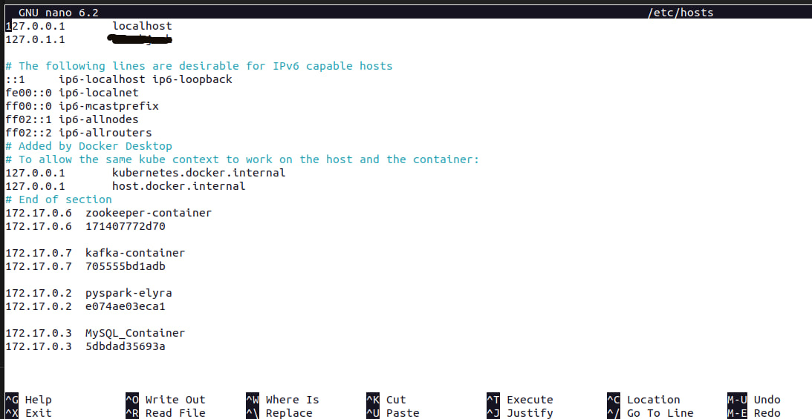
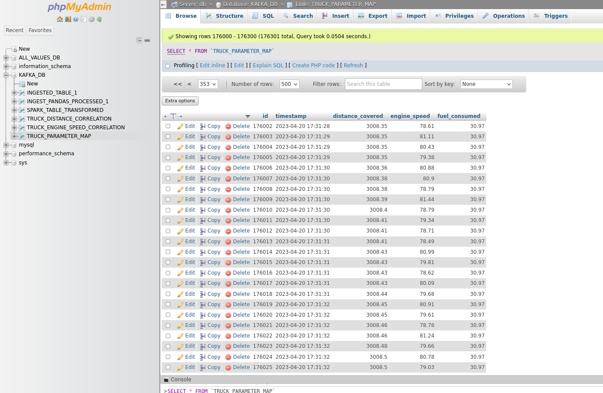
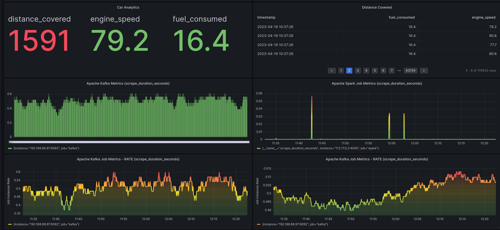
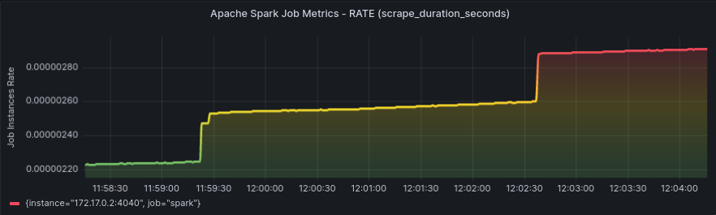
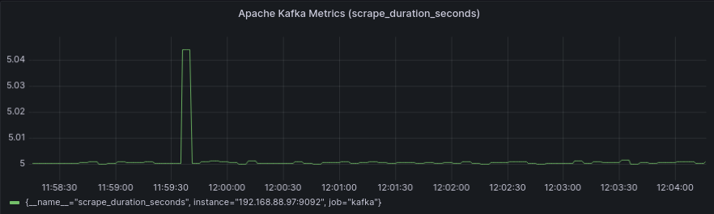
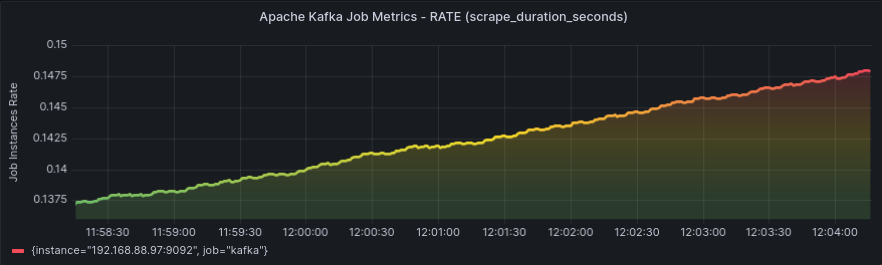
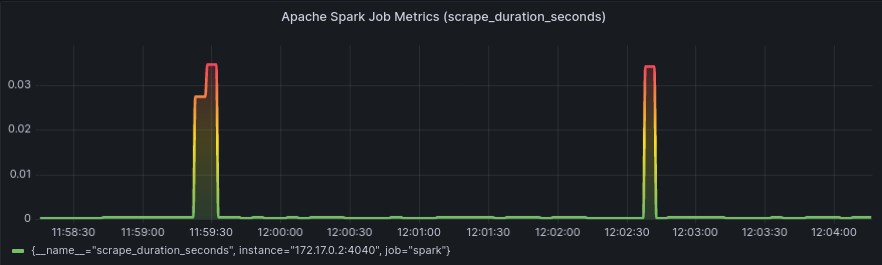

# Real-time Streaming Application with Visualizer

This "Data-Streaming-ETL-IUBH" repository is developed as a real-time streaming application that captures data from a python app that simulates streamed 1 million data instances from the movement of a truck as its source and ingests it into a data store for analysis and visualization. The goal is to provide a comprehensive solution that enables one to build, deploy and monitor your real-time data pipeline with ease.

<br>

 <br>
*Image above: High-level pipeline diagram showing how the real-time application functions*

<br>

## The Dataset

The streaming took over 3 days to generate 1 million messages. Kafka was generating at over 1000 messages per minute. (I was running this on a HDD not an SDD drive, so factor in the expected sluggishness and latency in the transfer rate with a HDD drive). The dataset looked like this:

```
INSERT INTO `TRUCK_PARAMETER_MAP` 
(`id`, `timestamp`, `distance_covered`, `engine_speed`, `fuel_consumed`) VALUES

(1922346, '2023-04-10 01:02:27', 0, 80.22, 0),
(1922347, '2023-04-10 01:02:28', 0.01, 79.2, 0),
(1922348, '2023-04-10 01:02:28', 0.02, 79.45, 0),
(1922349, '2023-04-10 01:02:29', 0.03, 79.54, 0),
(1922350, '2023-04-10 01:02:29', 0.03, 78.58, 0),
(1922351, '2023-04-10 01:02:29', 0.03, 80.83, 0),
(1922352, '2023-04-10 01:02:29', 0.05, 78.34, 0),
(1922353, '2023-04-10 01:02:30', 0.06, 80.13, 0),
(1922354, '2023-04-10 01:02:30', 0.07, 80.24, 0),
(1922355, '2023-04-10 01:02:30', 0.13, 80.62, 0),  

```
<br>

 <br>
*Image above: Spark Query Metrics generated from this project while Spark was running*

<br>

%20visualization.png "DAG - Visualization") <br>
*Image above: DAG (Directed Acyclic Graph) Visualization of our Spark Logic while Spark was processing Kafka messages.*

<br>

 <br>
*Image above: Query Stage ID and Task ID during Spark processing*

<br>

## How the code works

The python code consists of two separate applications, one serving as a Kafka producer script and the other as a Spark data processing script.

The Kafka producer script simulates the movement of a truck by generating random values for engine speed and time elapsed. The script connects to a MySQL database and creates a table named 'TRUCK_PARAMETER_MAP'. The script then generates data for distance covered, fuel consumption rate, and fuel remaining. It checks if the fuel remaining is above 0 and sends the generated data as a JSON object to a Kafka broker using the 'confluent_kafka' package. The package specifies the Kafka broker address and port number, maximum number of messages and maximum size of messages buffered in memory, compression type, and compression level. The 'produce_truck_data' function includes a loop to generate data points for a truck at a rate of approximately 1 point every 4 milliseconds. The script also includes a function to test network and server connection. If the host is reachable, the script will start producing messages to Kafka.


Then the Spark data processing script uses the PySpark library to create a streaming pipeline that reads data from a Kafka topic and processes it. This code reads streaming data from Kafka, transforms it using PySpark DataFrame operations, and writes the output to files or console periodically. The code can be modified to read from different sources or write to different sinks based on the specific use case.
Below is a brief summary of what the code does:

* Imports necessary PySpark modules and logging module.
* Sets up a SparkSession with specific configurations.
* Defines the Kafka consumer options, including the topic to read from, group ID, and consumer settings.
* Reads streaming data from Kafka and casts the value column to string type.
* Parses the JSON-formatted messages from Kafka using a pre-defined schema.
* Performs several transformations on the data, including filtering, selection, union, and computing new columns.
* Writes the resulting data streams to a file or console in CSV format with the specified output mode, location, and trigger settings.
* Starts the streaming query using the defined options and outputs.


## Prerequisites

 1. Docker installed on local machine or cloud IDEs.
 2. Basic knowledge of Apache Kafka, MySQL server and database handling, Apache Spark, containerization in-general and data visualization.
 3. Understanding of real-time streaming data, message brokering, resource handling and its processing.
 4. Linux OS makes life a lot easier. Avoid Windows OS when embarking on projects like this. 

## Requirements

  * Docker

  * Docker used containers below: 
  * Docker for Visual Studio Code - by Microsoft (Create, manage, and debug containerized applications on Docker)
  * Docker Explorer for Visual Studio Code - by Jun Han (Manage Docker Containers, Docker Images, Docker Hub and Azure Container Registry)
  * Apache Kafka (image source: ubuntu/kafka:latest)
  * Apache ZooKeeper  (image source: ubuntu/zookeeper:latest)
  * Apache Spark (image source: ruslanmv/pyspark-elyra:latest)
  * MySQL Server and Database:```version: 8.0.32-debian``` (image source: mysql:8.0.32-debian)
  * PhpMyAdmin:  (image source: phpmyadmin:latest) 
  * Prometheus for metrics logging (image source: prom/prometheus:latest)
  * Node-exporter-prometheus (image source: quay.io/prometheus/node-exporter:latest)
  * Grafana (image source: grafana/grafana:latest)
  * Docker-Autocompose (image source: ghcr.io/red5d/docker-autocompose:latest)

## Features

1. Python Clients for connections:  We have used SqlAlchemy library and Confluent-Kafka python libraries to write our kafka producer code.

1.1 Then we also use another python client code to write our Pyspark code that instantly receives produced Kafka messages and processes them super fast.

2. Data Ingestion: We have use the python script to collect and transport data from various sources to Apache Kafka.

3. Data Processing: Apache Spark is used to process the incoming data in real-time and make it available for further analysis.

4. Data Storage: MySQL Server and database is used to store the messages as they are being produced. Kafka produces and writes the messages row-by-row to our db, with an acknowledge and append function.

5. Monitoring: Prometheus and Node exporter are to collect, log metrics and resources in real-time.

6. Data Visualization: Grafana dashboard is used to create interactive dashboards and visualizations for the ingested data.


## Technical bottlenecks and mistakes faced throughout the project.

 These bottlenecks faced were complex and required advanced technical knowledge in containerization, database management, data processing, and visualization.

###### 1. Environment Setup Bottlenecks:

* We encountered bottlenecks while setting up the environment required to run the project. These included setting up Docker, configuring and linking multiple containers, and installing necessary dependencies.

* We faced challenges particularly with the correct version of Docker, setting up and linking Apache Kafka, Apache Zookeeper, and Apache Spark, as well as configuring MySQL, PhpMyAdmin, Prometheus, Node-exporter-prometheus, and Grafana.

* These bottlenecks were complex and required advanced knowledge of containerization, database management, and monitoring tools.


###### 2. Code Implementation Bottlenecks:

* We faced bottlenecks when implementing the code for this project. These included correctly configuring Apache Spark to read data from Apache Kafka, writing code to process and analyze data, and writing code to visualize the data in Grafana.

* We also encountered challenges when writing the PySpark code to read and process data from Kafka, as well as when visualizing the data in Grafana.


###### 3. Performance Bottlenecks:

* We experienced performance bottlenecks while running this project, which caused our code to run slowly or crash. These included issues with Kafka and Spark configuration, as well as memory and CPU usage.

* We also encountered issues with slow Kafka processing due to incorrect Kafka partitioning and with Spark running out of memory due to incorrect Spark configuration.

###### 4. Integration Bottlenecks:

* We encountered bottlenecks when integrating different components of the project, such as Apache Kafka, Apache Spark, and Grafana.

* Specifically, we had to integrate PySpark with Kafka to read and process data, and then integrate Grafana to visualize the processed data.


###### 5. Data Management Bottlenecks:

* We experienced bottlenecks when managing and storing data for the project. These included issues with data quality, data integrity, and data consistency.

* Specifically, we had to manage and store data in MySQL, which required careful attention to data quality, data integrity, and data consistency.


###### Below, is a Gantt of the second phase of challenges I encountered.

|                            Task                            | Start Date |  End Date  | Duration |
|:----------------------------------------------------------:|:----------:|:----------:|:--------:|
| Setting up Docker environment                              | 2023-03-10 | 2023-03-12 | 3 days   |
| Installing Apache Kafka and Zookeeper in Docker containers | 2023-03-12 | 2023-03-14 | 3 days   |
| Writing Python Kafka Producer and Consumer code            | 2023-03-15 | 2023-03-18 | 4 days   |
| Setting up MySQL Server and Database in Docker container   | 2023-03-19 | 2023-03-21 | 3 days   |
| Writing Python MySQL code for database connection          | 2023-03-22 | 2023-03-23 | 2 days   |
| Setting up Prometheus for metrics logging                  | 2023-03-24 | 2023-03-26 | 3 days   |
| Writing Python Flask code for metrics endpoint             | 2023-03-27 | 2023-03-29 | 3 days   |
| Setting up Grafana for visualization                       | 2023-03-30 | 2023-04-01 | 3 days   |
| Writing Spark Streaming code to consume Kafka topic data   | 2023-04-02 | 2023-04-04 | 3 days   |
|                                                            |            |            |          |


## Setup

    1. Docker pull or build all the images above.
    2. Docker run the following containers: Apache ZooKeeper, Apache Kafka, MySQL, phpMyAdmin (see docker_configs folder with yamls in the directory) and Grafana.
    3. Configure the python script to collect data from sources and transport it to Kafka.
    4. Configure Kafka to process the data


## Getting Started

Install Docker for Visual Studio Code and Docker Explorer for Visual Studio Code on your Ubuntu machine.

1. Install Docker for Visual Studio Code and Docker Explorer for Visual Studio Code on your Ubuntu machine. If you run into issues, check the official Docker installation guide for Ubuntu: https://docs.docker.com/engine/install/ubuntu/


Pull Docker images: Pull the Docker images for the containers you want to use by running the following commands:

        docker pull ubuntu/kafka:latest
        docker pull ubuntu/zookeeper:latest
        docker pull ruslanmv/pyspark-elyra:latest
        docker pull mysql:8.0.32-debian
        docker pull phpmyadmin:latest
        docker pull prom/prometheus:latest
        docker pull quay.io/prometheus/node-exporter:latest
        docker pull grafana/grafana:latest

-----------------------
### Pip Install Requirements 

Find ```requirements.txt``` file in the repository.

    numpy
    pandas
    matplotlib
    sqlalchemy
    confluent_kafka
    logging

### Container ports used in this project:

You can access the containers using the following URLs:

    Apache Kafka: localhost:9092
    Apache ZooKeeper: localhost:2181
    MySQL Server: localhost:3306
    PhpMyAdmin: localhost:8080
    Prometheus: localhost:9090
    Node-exporter: localhost:9100
    Grafana: localhost:3000

Link the containers: In your Python apps, ensure that you link the containers by using their respective container names as host names. For example, to connect to the MySQL server from your Python app, you would use mysql as the host name instead of localhost.

### Environment variables

Sometimes, Kafka or Spark or Zookeeper might not run because they can't communicate correctly, to ensure your computer sees their corresponding IP addresses, you can set the environment variables with LinuxOS environment by going to the directory  ```/etc/hosts``. Do this with elevated privileges by using:

    sudo nano /etc/hosts


You can find all IP addresses of your containers by running this command:

    docker container inspect <container_name or container ID>

Notice, how I add my docker container IP addresses and IDs into the hosts file.

 <br>
*Image above: Add Container IPs to the hosts file*


### Docker Running MySQL server & Database Container:
I installed MySQL docker image according to the linux debian on Ubuntu 22.04, but you can find other flavours on ```https://hub.docker.com/_/mysql ```

    docker pull mysql:8.0.32-debian

Starting our MySQL instance (find this command and details from ```https://hub.docker.com/_/mysql) ```:

    docker run --name MySQL_Container -e MYSQL_ROOT_PASSWORD=root -p 3306:3306 -d mysql:8.0.32-debian

For me, as seen above, I called the docker container "MySQL_Container".

Next, activate your MySQL shell by right-clicking against the MySQL_Container (In vscode) which is our MySQL server.

Then you'll see this prompt waiting for us to login to MySQL ---> ```root@a20370fbdbfc:/# ``` 

Now type this into the shell to login. We use ```'root'``` as ```username -u``` and ```'root' as -p password```. 

The command will look like this ---->    ```mysql -u root  -p```  
If that doesn't work, do this ------>     ```mysql --user=root --password=root``` 

After running MySQL on docker, and you are trying to enter mysql prompt, but you get this error, ```ERROR 2002 (HY000): Can't connect to local MySQL server through socket '/var/run/mysqld/mysqld.sock' (2)```, Just use the command below....replace with your container name and user name, so that it looks like ```sudo docker exec -it <container_name> mysql -u <user_name> -p```
 
    sudo docker exec -it MySQL_Container mysql -u root -p

OTHERWISE USE THIS BELOW:

    mysql --user=root --password=root

Once your login is successful, then we create a database to collect Kafka's producer messages. we will call the database "KAFKA_DB"

      mysql> CREATE DATABASE KAFKA_DB;

Then, we create a table inside this databse. To do this, we use the ```"use"``` command on the created DB as follows:

      mysql> use KAFKA_DB;

Then we create a Table using the schema or column names in the data we are trying to ingest. Our tables are called "INGESTED_TABLE_1", "TRUCK_PARAMETER_MAP", "TRUCK_DISTANCE_CORRELATION", "TRUCK_ENGINE_SPEED_CORRELATION". See below how we use SQL queries to create the respective tables.

    CREATE TABLE INGESTED_TABLE_1 (time float, seconds_elapsed float,  qz float, qy float, qx float, qw float, roll float, pitch float, yaw float);

  
    CREATE TABLE TRUCK_PARAMETER_MAP (
            `id` INT AUTO_INCREMENT PRIMARY KEY,
            `timestamp` DATETIME,
            `distance_covered` FLOAT,
            `engine_speed` FLOAT,
            `fuel_consumed` FLOAT
        );


    CREATE TABLE TRUCK_DISTANCE_CORRELATION (
        `id` INT AUTO_INCREMENT PRIMARY KEY,
        `distance_covered` DOUBLE,
        `time_elapsed` DOUBLE,
        `correlation` DOUBLE
    );

    CREATE TABLE TRUCK_ENGINE_SPEED_CORRELATION (
        `id` INT AUTO_INCREMENT PRIMARY KEY,
        `engine_speed` DOUBLE,
        `time_elapsed` DOUBLE,
        `correlation` DOUBLE
    );

After creating our tables in SQL, we must ensure that our Python code for producing Kafka messages has a function that instructs Python to create a database schema for the messages produced. See what the corresponding code snippets in python will look like below: 


 <br>
*Image above: Python code with MySQL table schema*


 <br>
*Image above: Python code to output to MySQL Database*


 <br>
*Image above: PhpMyAdmin and MySQL Server for MySQL Database displaying the table "TRUCK_PARAMETER_MAP" that hold our streamed Kafka messages.*


### Run PhpMyAdmin Container:

We use this to easily navigate through our MySQL database and MySQL server. It's a simple but powerful Web UI framework for that purpose. 

Now we install PhpMyAdmin - A web interface for MySQL:

    docker pull phpmyadmin:latest

After pulling phpMyAdmin, next, we need to run a MySQL server in Docker, and then the phpMyAdmin image needs to be linked to the running database container like this:
    
    docker run --name phpmyadmin -d --link MySQL_Container:db --restart always  -p 8085:80 phpmyadmin

Notice that our running container name "MySQL_Container" will then be linked to our phpMyAdmin image by adding "--link MySQL_Container:db" be sure to put the db at the end.


### Run ZooKeeper Container:

Fire up the Zookeeper container first of all.

I downloaded the ZooKeeper image specific to Ubuntu 22.04 from https://hub.docker.com/r/ubuntu/zookeeper with this command:

    docker pull ubuntu/zookeeper:3.1-22.04_beta

Then we do a docker run to run the ZooKeeper container with:

    docker run -d --name zookeeper-container -e TZ=UTC -p 2181:2181 ubuntu/zookeeper:latest

### Run Kafka Container:

We used ```docker pull ubuntu/kafka:3.1-22.04_beta``` to download the Kafka Image specific to Ubuntu 22.04 from https://hub.docker.com/r/ubuntu/kafka Then we do a docker run to run the kafka container.

    docker run -d --name kafka-container -e TZ=UTC -p 9092:9092 -e ZOOKEEPER_HOST=host.docker.internal ubuntu/latest

If Kafka can't find ZooKeeper which it needs to run, you might need to expose the Kafka port to the host network. You can do this by adding the --network host option to the docker run command:

    docker run -d --name kafka-container --network host -e TZ=UTC -e KAFKA_ADVERTISED_HOST_NAME=host.docker.internal -v volume-STREAM-IUBH:/data_streaming_project  -e KAFKA_ADVERTISED_PORT=9092 -e ZOOKEEPER_HOST=host.docker.internal ubuntu/kafka:latest

Note that in this case, you do not need to publish the Kafka port with -p since the container is using the host network. Also, make sure that any firewall or security groups are not blocking traffic to the Kafka port.


Now, create your Kafka Topic. We call ours "Truck-Data" (or a suitable name of your choice)

    kafka-topics --create --bootstrap-server localhost:9092 --replication-factor 2 --partitions 2 --topic Truck-Data

Also, in creating a Kafka topic (If in VSCode, just right-click against the running Kafka broker or kafka server, then select "Attach shell"). :

    ./kafka-topics.sh --create --bootstrap-server localhost:9092 --replication-factor 2 --partitions 2 --topic Truck-Data

OR (to add more partitions, and data retention settings....etc, use below)

    kafka-topics.sh --create --bootstrap-server localhost:9092 --replication-factor 2 --partitions 2 --topic Truck-Data


### Run Pyspark and Spark Container:

Now install Pyspark 

This application will create a jupyter notebook ready with Pyspark and Spark 3.1.2 with Hadoop 3.2

This is one of the best images out ther, it comes bundled with Pyspark, Spark (with Hadoop) and OpenJDK Java 11. It can't get any better!! 😋

If you haven't downloaded the Images, use this to do so:

    docker pull ruslanmv/pyspark-elyra:latest

In my case, I prefered to do a docker build of the image, so I used the docker build for Pyspark+Elyra link to install pyspark on docker as seen here: https://ruslanmv.com/blog/Docker-Container-with-Pyspark-and-Jupyter-and-Elyra

For convenience, here's how my Dockerfile for the Pyspark+Elyra Image looked:

```
# Copyright (c) Jupyter Development Team.
# Distributed under the terms of the Modified BSD License.
ARG OWNER=jupyter
ARG BASE_CONTAINER=$OWNER/scipy-notebook
FROM $BASE_CONTAINER

LABEL maintainer="Jupyter Project <jupyter@googlegroups.com>"

# Fix DL4006
SHELL ["/bin/bash", "-o", "pipefail", "-c"]

USER root

# Spark dependencies
# Default values can be overridden at build time
# (ARGS are in lower case to distinguish them from ENV)
ARG spark_version="3.1.2"
ARG hadoop_version="3.2"
ARG spark_checksum="2385CB772F21B014CE2ABD6B8F5E815721580D6E8BC42A26D70BBCDDA8D303D886A6F12B36D40F6971B5547B70FAE62B5A96146F0421CB93D4E51491308EF5D5"
ARG openjdk_version="11"

ENV APACHE_SPARK_VERSION="${spark_version}" \
    HADOOP_VERSION="${hadoop_version}"
ENV JUPYTER_ENABLE_LAB=yes
RUN apt-get update --yes && \
    apt-get install --yes --no-install-recommends \
    "openjdk-${openjdk_version}-jre-headless" \
    ca-certificates-java  \
    curl && \
    apt-get clean && rm -rf /var/lib/apt/lists/*
    
RUN pip install pyarrow

# Install nodejs
# Node
RUN curl -fsSL https://deb.nodesource.com/setup_16.x | sudo -E bash -
RUN sudo apt-get install -y nodejs
RUN echo "NODE Version:" && node --version
RUN echo "NPM Version:" && npm --version
# Install Elyra
RUN  pip3 install --upgrade pip==20.2.4  && pip3 install --no-cache-dir  --upgrade  elyra[all]
RUN jupyter lab  build --dev-build=False --minimize=False
#  Install requirements
#COPY requirements.txt ./
#RUN pip3 install --no-cache-dir -r requirements.txt
#RUN apt-get clean && rm requirements.txt

# Spark installation
WORKDIR /tmp
RUN wget -q "https://archive.apache.org/dist/spark/spark-${APACHE_SPARK_VERSION}/spark-${APACHE_SPARK_VERSION}-bin-hadoop${HADOOP_VERSION}.tgz" && \
    echo "${spark_checksum} *spark-${APACHE_SPARK_VERSION}-bin-hadoop${HADOOP_VERSION}.tgz" | sha512sum -c - && \
    tar xzf "spark-${APACHE_SPARK_VERSION}-bin-hadoop${HADOOP_VERSION}.tgz" -C /usr/local --owner root --group root --no-same-owner && \
    rm "spark-${APACHE_SPARK_VERSION}-bin-hadoop${HADOOP_VERSION}.tgz"

WORKDIR /usr/local

# Configure Spark
ENV SPARK_HOME=/usr/local/spark
ENV SPARK_OPTS="--driver-java-options=-Xms1024M --driver-java-options=-Xmx4096M --driver-java-options=-Dlog4j.logLevel=info" \
    PATH="${PATH}:${SPARK_HOME}/bin"

RUN ln -s "spark-${APACHE_SPARK_VERSION}-bin-hadoop${HADOOP_VERSION}" spark && \
    # Add a link in the before_notebook hook in order to source automatically PYTHONPATH
    mkdir -p /usr/local/bin/before-notebook.d && \
    ln -s "${SPARK_HOME}/sbin/spark-config.sh" /usr/local/bin/before-notebook.d/spark-config.sh

# Fix Spark installation for Java 11 and Apache Arrow library
# see: https://github.com/apache/spark/pull/27356, https://spark.apache.org/docs/latest/#downloading
RUN cp -p "${SPARK_HOME}/conf/spark-defaults.conf.template" "${SPARK_HOME}/conf/spark-defaults.conf" && \
    echo 'spark.driver.extraJavaOptions -Dio.netty.tryReflectionSetAccessible=true' >> "${SPARK_HOME}/conf/spark-defaults.conf" && \
    echo 'spark.executor.extraJavaOptions -Dio.netty.tryReflectionSetAccessible=true' >> "${SPARK_HOME}/conf/spark-defaults.conf"

USER ${NB_UID}


WORKDIR "${HOME}"
```

After you have docker built the image with (be sure to include the full-stop at the end of notebook): 

    docker build --rm -t ruslanmv/pyspark-notebook .

, thereafter, use this to run the container: 

Without Elyra node visualizer (but contains Jupyter Notebook):

    docker run  --name pyspark-notebook  -it -p 8888:8888  -v /path to your volume folder:/home/jovyan/work  -d ruslanmv/pyspark-notebook


With Elyra node visualizer, and Jupyter notebook(I used this):

    docker run  --name pyspark-elyra -it -p 8888:8888 -v /path to your volume folder:/home/jovyan/work   -d ruslanmv/pyspark-elyra


- Now check for jupyter URL(with token) in the pyspark container's logs. right-click on it an select "view logs".


Finally, to run our python script, we use ```Spark-Submit`` function to consume our code this way:

    spark-submit --master local[*] --packages org.apache.spark:spark-sql-kafka-0-10_2.12:3.1.2  ./path-to-your-python-file.py


The above ordinarily works fine, but if you run into error request for mysql-connector-java-8.0.32.jar files, you can try this after downloading the mysql-connector-java JAR file from the appropriate website:

    spark-submit --master local[*] --packages org.apache.spark:spark-sql-kafka-0-10_2.12:3.1.2 --jars /path_to/mysql-connector-java-8.0.32.jar  ./path-to-your-python-file.py

If it works, visit http://localhost:4040 to see your Spark job results. Below is a video and screenshots of Spark processing the Kafka messages.


 <br>
*Video above: Actual demonstration of the Spark Web UI while processing the Kafka messages in this project*
<br>


### Docker Running Prometheus and Grafana Containers:

After installing Prometheus, you will need a Node-exporter that helps to scrape metrics to be exported.

Step1: Follow this video to download Node-exporter first >> https://www.youtube.com/watch?v=uCYfDtR9S9k&t=26s


    docker run -d \
    --net="host" \
    --pid="host" \
    -v "/:/host:ro,rslave" \
    quay.io/prometheus/node-exporter \
    --path.rootfs=/host


Step 2: Create ```Prometheus.yml``` (see files in the repository)

```
global:
  scrape_interval: 5s
  external_labels:
    monitor: 'node'
scrape_configs:
  - job_name: 'prometheus'
    static_configs:
      - targets: ['192.168.88.97:9090'] ## IP Address of the localhost

  - job_name: 'node-exporter'
    static_configs:
      - targets: ['192.168.88.97:9100'] ## IP Address of the localhost

  - job_name: 'spark'
    static_configs:
      - targets: ['172.17.0.2:4040', '172.17.0.2:8080', '172.17.0.2:7077']    
      
  - job_name: 'kafka'
    static_configs:
      - targets: ['192.168.88.97:9092']
  
```
      

```
For example, 192.168.88.97 was the ip address of our host machine and we get it
by using "ifconfig" command in our linux terminal.

In my case, i got the following when i use it and scrolled to the base wlx.... to 
see the value of the inet address:

 vethcarh8fb: flags=4163<UP,BROADCAST,RUNNING,MULTICAST>  mtu 1500
        inet6 fe80::687c:9cff:fe4f:bdd2  prefixlen 64  scopeid 0x20<link>
        ether 1a:7c:6c:4f:ad:d2  txqueuelen 0  (Ethernet)
        RX packets 0  bytes 0 (0.0 B)
        RX errors 0  dropped 0  overruns 0  frame 0
        TX packets 494  bytes 88296 (88.2 KB)
        TX errors 0  dropped 0 overruns 0  carrier 0  collisions 0

wlx28ee520868b9: flags=4163<UP,BROADCAST,RUNNING,MULTICAST>  mtu 1500
        inet 192.164.22.37  netmask 255.255.255.0  broadcast 192.168.88.255
        inet6 ge605:f18f:1098:a20e:587r  prefixlen 64  scopeid 0x20<link>
        ether 16:gg:56:08:68:k9  yxlutullen 1000  (Ethernet)
        RX packets 822150  bytes 955915554 (955.9 MB)
        RX errors 0  dropped 214097  overruns 0  frame 0
        TX packets 470142  bytes 79273897 (79.2 MB)
        TX errors 0  dropped 0 overruns 0  carrier 0  collisions 0
```

After you've docker pulled (Installing) Prometheus from docker >> https://hub.docker.com/r/prom/prometheus

Bind-mount your prometheus.yml from the host by running the code below
Ensure you cd into the container containing the prometheus.yml before running this code:

    docker run -d --name prometheus -p 9090:9090 -v $PWD/prometheus.yml:/etc/prometheus/prometheus.yml prom/prometheus


 <br>
*Video above: Actual demonstration of our Prometheus Dashboard visualizing scraped Kafka metrics from Prometheus and MySQL Database in this project*
<br>

 <br>
*Video above: Screenshot of demonstration of our Prometheus Dashboard visualizing scraped Kafka metrics from Prometheus and MySQL Database*
*Notice the use of PromQL functions like '''scrape_duration_seconds{instance="172.17.0.2:4040", job="spark"}''' to run transformations on our scraped metrics*
<br>


Step 4: Install Grafana from docker website >> https://hub.docker.com/r/grafana/grafana

    docker run -d --name=grafana -p 3000:3000 grafana/grafana


When you try to connect prometheus to in Grafana and you get this error: ```Err reading Prometheus: Post "http://localhost:9090/api/v1/query": dial tcp 127.0.0.1:9090: connect: connection refused```, you can just use the docker inspect command to find the IP address of the Prometheus container and then replace the localhost word with it.

 <br>
*Video above: Actual demonstration of our GRAFANA DASHBOARD visualizing scraped Kafka metrics from Prometheus and MySQL Database in this project*
<br>

 <br>
 <br>
 <br>
 <br>
 <br>
 <br>


### Run Apache/Nifi Containers:

Get and install Docker images for Apache NiFi from https://hub.docker.com/r/apache/nifi

This image currently supports running in standalone mode either unsecured or with user authentication provided through:

    * Single User Authentication
    * Mutual TLS with Client Certificates
    * Lightweight Directory Access Protocol (LDAP)

This image also contains the NiFi Toolkit (as of version 1.8.0) preconfigured to use either in secure and unsecure mode.

We use a docker pull to download it as follows:

    docker pull apache/nifi

Run a simple service by using:

    docker run --name nifi \
    -p 8443:8443 \
    -d \
    apache/nifi:latest


To see the Web UI for Nifi, you need to go to https://localhost:8443 NOT http://localhost:8443. By default NiFi is now secured with TLS, but 8443 is not the standard HTTPS port, thus it does not automatically redirect you to HTTPS if you only enter localhost

For a minimal, connection to an LDAP server using SIMPLE authentication:

    docker run --name nifi \
    -v /home/blackjack/Data-Streaming-ETL-IUBH-main/Data-Streaming-ETL-IUBH/localhosts:/opt/certs \
    -p 8443:8443 \
    -e AUTH=ldap \
    -e SSL_ENABLED=false \
    -e KEYSTORE_PATH=data_streaming_project/localhosts/keystore.jks \
    -e KEYSTORE_TYPE=JKS \
    -e KEYSTORE_PASSWORD=0000 \
    -e TRUSTSTORE_PATH=data_streaming_project/localhosts/keystore.jks \
    -e TRUSTSTORE_PASSWORD=0000 \
    -e TRUSTSTORE_TYPE=JKS \
    -e INITIAL_ADMIN_IDENTITY='cn=admin,dc=example,dc=org' \
    -e LDAP_AUTHENTICATION_STRATEGY='SIMPLE' \
    -e LDAP_MANAGER_DN='cn=admin,dc=example,dc=org' \
    -e LDAP_MANAGER_PASSWORD='password' \
    -e LDAP_USER_SEARCH_BASE='dc=example,dc=org' \
    -e LDAP_USER_SEARCH_FILTER='cn={0}' \
    -e LDAP_IDENTITY_STRATEGY='USE_DN' \
    -e LDAP_URL='ldap://ldap:389' \
    -d \
    apache/nifi:latest


## Run Apache ATLAS Containers:

Apache ATLAS failed to run despite all efforts. We have logged the bug/problem in the Issues' section of this repository. Click to see issue >>  https://github.com/Chuka-J-Uzo/Data-Streaming-ETL-IUBH/issues/2

However, if all works fine for you, here's an installation procedure to get Apache Atlas running.

Download Apache Atlas Docker image here:

    docker pull sburn/apache-atlas  


This Apache Atlas is built from the 2.3.0-release source tarball and patched to be run in a Docker container.

Atlas is built with embedded HBase + Solr and it is pre-initialized, so you can use it right after image download without additional steps.

###### Basic usage of Apache Atlas

Start Apache Atlas in a container exposing Web-UI port 21000:

    docker run -d \
        -p 21000:21000 \
        --name atlas \
        sburn/apache-atlas

Please, take into account that the first startup of Atlas may take up to few mins depending on host machine performance before web-interface become available at http://localhost:21000/

Web-UI default credentials: ```admin / admin```

To start Atlas overriding settings by environment variables (to support large number of metadata objects for example):

    docker run --detach \
        -e "ATLAS_SERVER_OPTS=-server -XX:SoftRefLRUPolicyMSPerMB=0 \
        -XX:+CMSClassUnloadingEnabled -XX:+UseConcMarkSweepGC \
        -XX:+CMSParallelRemarkEnabled -XX:+PrintTenuringDistribution \
        -XX:+HeapDumpOnOutOfMemoryError -XX:HeapDumpPath=dumps/atlas_server.hprof \
        -Xloggc:logs/gc-worker.log -verbose:gc -XX:+UseGCLogFileRotation \
        -XX:NumberOfGCLogFiles=10 -XX:GCLogFileSize=1m -XX:+PrintGCDetails \
        -XX:+PrintHeapAtGC -XX:+PrintGCTimeStamps" \
        -v ${PWD}/data:/apache-atlas/data \
        -p 21000:21000 \
        --name atlas \
        sburn/apache-atlas


To explore logs: start Atlas exposing logs directory on the host

    docker run --detach \
        -v ${PWD}/atlas-logs:/apache-atlas/logs \
        -p 21000:21000 \
        --name atlas \
        sburn/apache-atlas

For custom configuration: start Atlas exposing conf directory on the host

    docker run --detach \
        -v ${PWD}/pre-conf:/apache-atlas/conf \
        -p 21000:21000 \
        --name atlas \
        sburn/apache-atlas

To enable Data persistency: start Atlas with data directory mounted on the host

    docker run --detach \
        -v ${PWD}/data:/apache-atlas/data \
        -p 21000:21000 \
        --name atlas \
        sburn/apache-atlas


##### Downloading Hooks for Apache Atlas

Hooks will help use execute data lineage, data discovery etc.

You can download the Apache Atlas source tarball using the wget command in Linux terminal. Open a terminal window and type the following command:

```wget https://dlcdn.apache.org/atlas/2.0.0/apache-atlas-2.0.0-sources.tar.gz ```


This will download the file to your current directory. You can then extract the contents of the tarball using the tar command:

    tar -xzf apache-atlas-2.0.0-sources.tar.gz 


##### Usage options for Apache Atlas

To gracefully stop Atlas:

    docker exec -ti atlas /apache-atlas/bin/atlas_stop.py

To check Atlas startup script output:

    docker logs atlas

To check Atlas application.log (useful at the first run and for debugging during workload):

    docker exec -ti atlas tail -f /apache-atlas/logs/application.log

To run the example (this will add sample types and instances along with traits):

    docker exec -ti atlas /apache-atlas/bin/quick_start.py

##### Environment Variables for Apache Atlas

The following environment variables are available for configuration:

|          **Name**         |            **Default**            |                                                **Description**                                               |
|:-------------------------:|:---------------------------------:|:------------------------------------------------------------------------------------------------------------:|
| JAVA_HOME                 | /usr/lib/jvm/java-8-openjdk-amd64 | The java implementation to use. If JAVA_HOME is not found we expect java and jar to be in path               |
| ATLAS_OPTS                |                                   | any additional java opts you want to set. This will apply to both client and server operations               |
| ATLAS_CLIENT_OPTS         |                                   | any additional java opts that you want to set for client only                                                |
| ATLAS_CLIENT_HEAP         |                                   | java heap size we want to set for the client. Default is 1024MB                                              |
| ATLAS_SERVER_OPTS         |                                   | any additional opts you want to set for atlas service.                                                       |
| ATLAS_SERVER_HEAP         |                                   | java heap size we want to set for the atlas server. Default is 1024MB                                        |
| ATLAS_HOME_DIR            |                                   | What is is considered as atlas home dir. Default is the base location of the installed software              |
| ATLAS_LOG_DIR             |                                   | Where log files are stored. Defatult is logs directory under the base install location                       |
| ATLAS_PID_DIR             |                                   | Where pid files are stored. Defatult is logs directory under the base install location                       |
| ATLAS_EXPANDED_WEBAPP_DIR |                                   | Where do you want to expand the war file. By Default it is in /server/webapp dir under the base install dir. |


## Run Apache Ranger Container:

Also we encountered a bug that prevented Apache Ranger from running. For this reason, we have been unable to use it to enforce access control to key containers like Kafka. Here, we document the issue as a bug requiring resolution. Click to see issue >> https://github.com/Chuka-J-Uzo/Data-Streaming-ETL-IUBH/issues/1